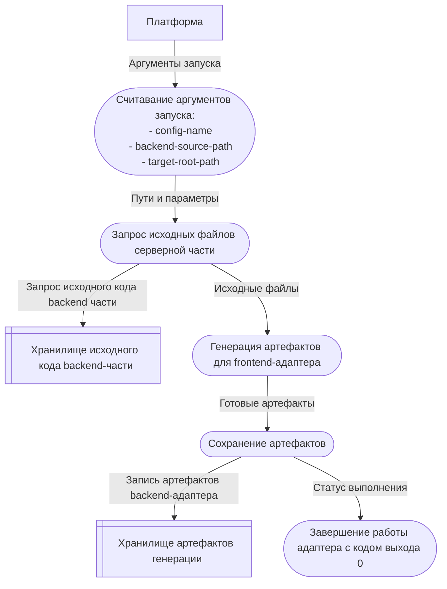

Общая DFD работы backend адаптеров

```mermaid
flowchart TD
    StartB["Платформа"] -- Аргументы запуска --> ArgsB(["Считавание аргументов запуска:
    - config-name
    - backend-source-path
    - target-root-path"])
    ArgsB -- Пути и параметры --> P1(["Запрос исходных файлов серверной части"])
    P1 -- Запрос исходного кода backend части --> BackendSourceCodeDir(["Хранилище исходного кода backend-части"])
    P1 -- Исходные файлы --> P3(["Генерация артефактов для frontend-адаптера"])
    P3 -- Готовые артефакты --> P4(["Сохранение артефактов"])
    P4 -- Запись артефактов backend-адаптера --> ArtifactsDir["Хранилище артефактов генерации"]
    P4 -- Статус выполнения --> EndB(["Завершение работы адаптера с кодом выхода 0"])

    StartB@{ shape: rect}
    ArtifactsDir@{ shape: internal-storage}
    BackendSourceCodeDir@{ shape: internal-storage}
```