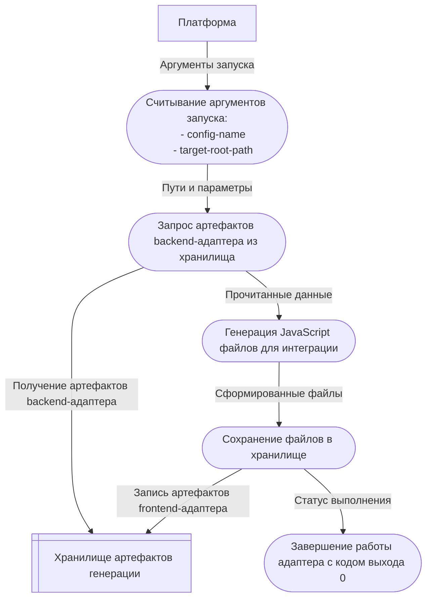

Общая DFD работы frontend адаптеров

```mermaid
flowchart TD
    StartF["Платформа"] -- Аргументы запуска --> ArgsF(["Считывание аргументов запуска:
    - config-name
    - target-root-path"])
    ArgsF -- Пути и параметры --> ReadArtifacts(["Запрос артефактов backend-адаптера из хранилища"])
    ReadArtifacts -- Получение артефактов backend-адаптера --> ArtifactsDir
    ReadArtifacts -- Прочитанные данные --> GenerateFiles(["Генерация JavaScript файлов для интеграции"])
    GenerateFiles -- Сформированные файлы --> SaveFiles(["Сохранение файлов в хранилище"])
    SaveFiles -- Запись артефактов frontend-адаптера --> ArtifactsDir["Хранилище артефактов генерации"]
    SaveFiles -- Статус выполнения --> EndF(["Завершение работы адаптера с кодом выхода 0"])

    StartF@{ shape: rect}
    ArtifactsDir@{ shape: internal-storage}
```