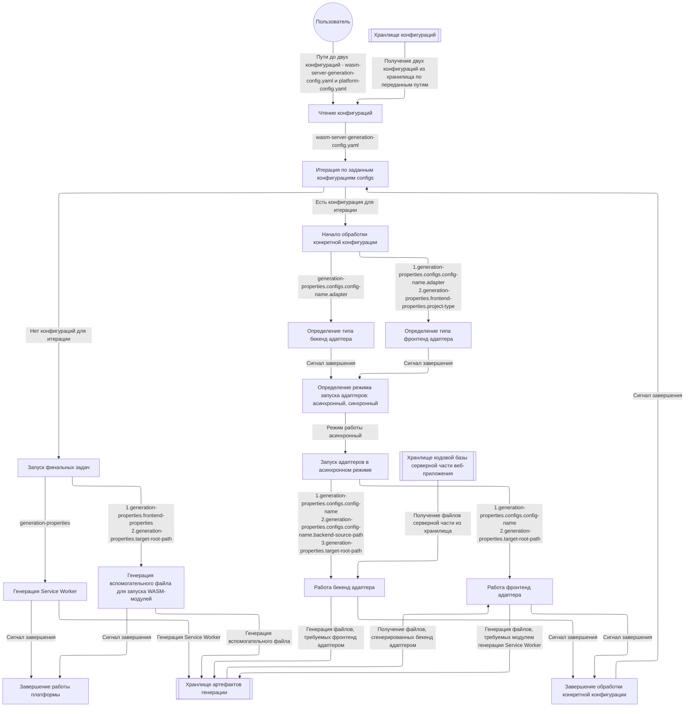

DFD платформы для асинхронного режима работы адаптеров

```mermaid
---
config:
  layout: elk
---
flowchart TD
    Пользователь(("Пользователь")) -- "Пути до двух конфигураций - wasm-server-generation-config.yaml и platform-config.yaml" --> P1["Чтение конфигураций"]
    D3[["Хранлище конфигураций"]] -- Получение двух конфигураций из хранилища по переданным путям--> P1
    P1 -- "wasm-server-generation-config.yaml" --> P9["Итерация по заданным конфигурациям configs"]
    P9 -- Есть конфигурация для итерации --> P10["Начало обработки конкретной конфигурации"]
    P9 -- Нет конфигураций для итерации --> P11["Запуск финальных задач"]
    P12["Завершение работы платформы"]
    P10 -- "generation-properties.configs.config-name.adapter" --> P2["Определение типа бекенд адаптера"]
    P10 -- "1.generation-properties.configs.config-name.adapter
        2.generation-properties.frontend-properties.project-type" --> P4["Определение типа фронтенд адаптера"]
    P2 -- Сигнал завершения --> P15["Определение режима запуска адаптеров: асинхронный, синхронный"]
    P4 -- Сигнал завершения --> P15
    P15 -- Режим работы асинхронный --> P14["Запуск адаптеров в асинхронном режиме"]
    P11 -- "generation-properties" --> P6["Генерация Service Worker"]
    P11 -- "1.generation-properties.frontend-properties
        2.generation-properties.target-root-path" --> P8["Генерация вспомогательного файла для запуска WASM-модулей"]
    P14 -- "1.generation-properties.configs.config-name
        2.generation-properties.configs.config-name.backend-source-path
        3.generation-properties.target-root-path" --> P3["Работа бекенд адаптера"]
    P14 -- "1.generation-properties.configs.config-name
        2.generation-properties.target-root-path" --> P5["Работа фронтенд адаптера"]
    P8 -- Cигнал завершения --> P12
    P8 -- Генерация вспомогательного файла --> D2[["Хранлище артефактов генерации"]]
    D4[["Хранлище кодовой базы серверной части веб-приложения"]] -- Получение файлов серверной части из хранилища --> P3
    D2 -- Получение файлов, сгенерированных бекенд адаптером --> P5
    P3 -- Генерация файлов, требуемых фронтенд адаптером --> D2
    P3 -- Сигнал завершения --> P7["Завершение обработки конкретной конфигурации"]
    P5 -- Генерация файлов, требуемых модулем генерации Service Worker --> D2
    P5 -- Сигнал завершения --> P7
    P6 -- Генерация Service Worker --> D2
    P6 -- Сигнал завершения --> P12
    P7 -- Сигнал завершения --> P9
```